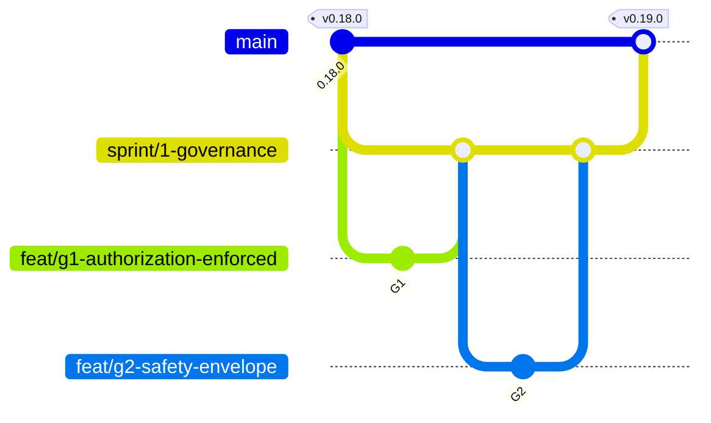

# Branching

`main` is the product. Everything else is temporary.

This repo runs **trunk-based development with sprint integration branches**: a
short-lived branch per backlog item, gathered on a branch per sprint, merged
into `main` when the sprint closes. Several sprints run at once, which is the
whole reason the middle layer exists — without it, four streams of work land on
`main` interleaved and no sprint can be reviewed, reverted, or described as a
unit.

Nothing here rests on discipline alone. `main` is protected, CI gates every
merge, and `CODEOWNERS` means nobody merges their own work.

---

## The three layers



| Layer | Pattern | Cut from | Lives | Merges into |
| --- | --- | --- | --- | --- |
| Trunk | `main` | — | forever | — |
| Sprint | `sprint/<n>-<theme>` | `main` | one sprint (≤ 2 weeks) | `main` |
| Work | `<type>/<id>-<slug>` | its sprint branch | hours to days | its sprint branch |
| Hotfix | `hotfix/<id>-<slug>` | `main` | as long as it takes | `main`, then forward into every live sprint |

### `main`

Always releasable. Every commit on it is green, every version on it is tagged,
and no one pushes to it directly — a merged pull request is the only way in.

### `sprint/<n>-<theme>`

One integration branch per sprint, named for what the sprint is *for*, not when
it happens: `sprint/1-governance`, not `sprint/2026-w34`. Themes outlive
calendars. It is cut from `main` at sprint start and deleted after it merges.

A sprint branch is **shared**, so it is never rebased and never force-pushed.
Keep it current by merging `main` into it — at minimum whenever `main` moves,
and always before opening the sprint's pull request. A sprint branch that has
not seen `main` in a week is not a sprint, it is a fork.

Sprint branches are capped at two weeks for one reason: the cost of a
long-lived branch is not linear. Four weeks of divergence is considerably more
than twice the merge pain of two.

### Work branches

One branch per backlog item, carrying that item's ID from `ROADMAP.md` and
`PRODUCT_TRACKER.md`:

```
feat/g1-authorization-enforced
feat/o2-run-event-stream
fix/h4-session-expiry-false-positive
docs/qa4-report-review-notes
```

| Prefix | For |
| --- | --- |
| `feat/` | a new capability — the default for a ROADMAP item |
| `fix/` | a defect in shipped behaviour |
| `perf/` | faster or lighter, same observable behaviour |
| `refactor/` | internal shape only; no behaviour change |
| `test/` | coverage with no production change |
| `docs/` | markdown, README, RUNBOOK, examples |
| `ci/` | workflows, runners, caching |
| `chore/` | dependencies, tooling, repo plumbing |
| `hotfix/` | a defect in a released version that cannot wait for its sprint |

Work branches are private until reviewed, so **rebase them freely** onto their
sprint branch. Rebasing resolves conflicts once, in your own history, instead of
depositing them in the sprint's.

---

## Merge strategy

Deliberately different at each layer, because each layer answers a different
question.

| Merge | Strategy | Why |
| --- | --- | --- |
| work → sprint | **Squash** | One commit per backlog ID. `git log sprint/1-governance` reads as a list of items, not a list of keystrokes. |
| sprint → `main` | **Merge commit** (`--no-ff`) | The merge commit *is* the sprint; its parents are the items. A sprint stays revertible as a unit and readable as a list. |
| hotfix → `main` | **Squash** | One commit, easy to cherry-pick into every live sprint branch. |

Squash commit subjects carry the backlog ID, matching the history already on
`main`:

```
G1: refuse to run against prod without recorded authorization
O2: run event stream (events.jsonl)
```

---

## Running sprints in parallel

Four sprint branches open at once is the point, and also the risk. Three things
keep it from becoming a merge queue:

1. **Sprints own disjoint files.** Every ROADMAP item lists its **Files**. Before
   cutting a sprint, read those lines across its items *and* across the other
   live sprints. Two sprints both rewriting `models.py` is a decision, not an
   accident — make it deliberately or resequence.
2. **`models.py`, `config.py` and `reports.py` are the contended files.** Nearly
   every item touches at least one. Land changes to them early in a sprint and
   merge that sprint's branch into the others the same day, so the other sprints
   build on the new shape rather than discovering it at the end.
3. **Merge order is decided up front, not at the end.** The sprint that moves the
   shared models merges to `main` first. The others merge `main` back into
   themselves immediately afterwards.

### Current sprints

| Branch | Epic | Items | Spec |
| --- | --- | --- | --- |
| `sprint/1-governance` | `EPIC-GOV` | `G1` `G2` `G3` `G4` | `ROADMAP.md` § G |
| `sprint/2-field-validation` | `EPIC-QA` | `QA.1` `QA.2` `QA.3` `QA.4` | `PRODUCT_TRACKER.md` § Needs real-world validation |
| `sprint/3-devex` | `EPIC-DEVEX` | `X7` — labels, releases, branching, project board | `BRANCHING.md`, `RELEASING.md` |
| `sprint/4-deferred` | `EPIC-DEFER` | `X4` `X6` `L4` | `ROADMAP.md` § E, § I — deliberately deferred |

`sprint/4-deferred` exists so the deferral is visible rather than forgotten.
ROADMAP defers `X4` until crawl times actually hurt and `X6` until data volume
demands a database. Do not open work branches off it without a reason that has
changed — `L4` is the spike that could supply one for `X4`.

### Queued sprints

Seven more are specified and not yet cut. They are listed here because their
*order* is the decision, and it was made up front rather than at the end.

| Branch | Epic | Items | Cut after |
| --- | --- | --- | --- |
| `sprint/8-redaction` | `EPIC-GOV` | `G5` `G6` `G7` | `sprint/1-governance` merges |
| `sprint/5-discovery` | `EPIC-MAP` | `M1` `M2` `M3` `M4` `H6` `H7` `H8` | 8 merges |
| `sprint/6-liveness` | `EPIC-FRESH` | `L1` `L2` `L3` `C3` | 5 merges |
| `sprint/7-reachability` | `EPIC-INTERACT` | `I1` `I2` `I3` | 6 merges |
| `sprint/9-watch` | `EPIC-WATCH` | `W1` `W2` `W3` `W4` `H10` `X9` | 7 merges |
| `sprint/10-variants` | `EPIC-VARIANT` | `PV1` `PV2` `PV3` `H9` `H11` | 9 merges |
| `sprint/11-vocabulary` | `EPIC-VOCAB` | `T1` `T2` `T3` | 10 merges |

These **do not run in parallel**, for the reason the section above gives:
`models.py`, `config.py`, `crawler.py` and `reports.py` are contended across all
of them, and seven sprints rewriting the same four files is the merge queue this
model exists to avoid. The numbers are identifiers, not an order — the order is
the *Cut after* column, and `sprint/8-redaction` goes first despite its number.

**Why 8 jumps the queue.** `G5`–`G7` are the only P0s in the queued set.
`QA.2` — a real run against a real authenticated portal — is already in flight,
and every such run writes a capture folder containing real customer names,
addresses and account references in the element model, the ARIA snapshot,
`elements.csv` and every screenshot. `G4` governs how long that survives; `G5`
and `G6` govern whether it is written at all. The weaker guarantee does not go
first.

Several sprints deliberately absorb items from other epics rather than leaving
them for a themed sprint of their own, because the alternative is contending the
same file twice:

- 5 takes `H6`–`H8`: they turn on the same same-site and scope decisions as
  `M1`/`M2`, all in `crawler.py` and `util.py`.
- 6 takes `C3`: `diff.py` is already open for `L2`.
- 9 takes `H10` and `X9`: a scheduled run wants a fixed URL list and a cheap
  profile, and both are what make `W1` worth scheduling at all.
- 10 takes `H9` and `H11`: both are capture-configuration items in
  `browser.py`/`extraction.py`, exactly where `PV1` and `PV2` live.

Within each sprint, land the `config.py` and `models.py` shape first — `M1` in
5, `G5` in 8, `PV1` in 10 — then build on it. Same rule as point 2 above.

---

## Protection

`main` carries a ruleset requiring:

- a pull request, with **Code Owner** review (`.github/CODEOWNERS` → `@abhishekpauly`);
- the `full-ok` check green (`fast` and `full` both feed it);
- linear history **off** — sprint merges are merge commits by design;
- no force-push, no deletion.

`sprint/**` carries a lighter ruleset: no force-push, no deletion, and `full-ok`
required to merge. Work branches are unprotected — they are meant to be rewritten.

CI runs on every pull request whatever its base, and on pushes to `main` and
`sprint/**`, so a sprint branch is known-green before its pull request is opened
rather than at the moment it is due.

---

## The loop, end to end

```bash
# 1. start a sprint
git switch main && git pull
git switch -c sprint/1-governance
git push -u origin sprint/1-governance

# 2. take an item
git switch -c feat/g1-authorization-enforced sprint/1-governance
#    ... build, test, update PRODUCT_TRACKER.md + CHANGELOG.md ...
pytest -q
git push -u origin feat/g1-authorization-enforced
gh pr create --base sprint/1-governance --fill

# 3. keep the sprint current  (merge, never rebase — it is shared)
git switch sprint/1-governance && git pull
git merge origin/main

# 4. close the sprint
gh pr create --base main --head sprint/1-governance \
   --title "Sprint 1 — governance (G1-G4)"
#    merge with a MERGE COMMIT, then tag the release — see RELEASING.md
git push origin --delete sprint/1-governance
```

---

## Rules that are not negotiable

- **Never push to `main`.** The ruleset will refuse; do not ask it not to.
- **Never force-push a shared branch** — `main` or any `sprint/**`.
- **One backlog item per work branch.** Two items in one branch cannot be
  reviewed separately or reverted separately.
- **A red branch does not merge.** `pytest -q` locally, `full-ok` in CI.
- **Delete the branch after it merges.** A merged branch left open is a question
  every reader has to answer again.

`CONTRIBUTING.md` covers what a change must contain. `RELEASING.md` covers what
happens after a sprint lands.
